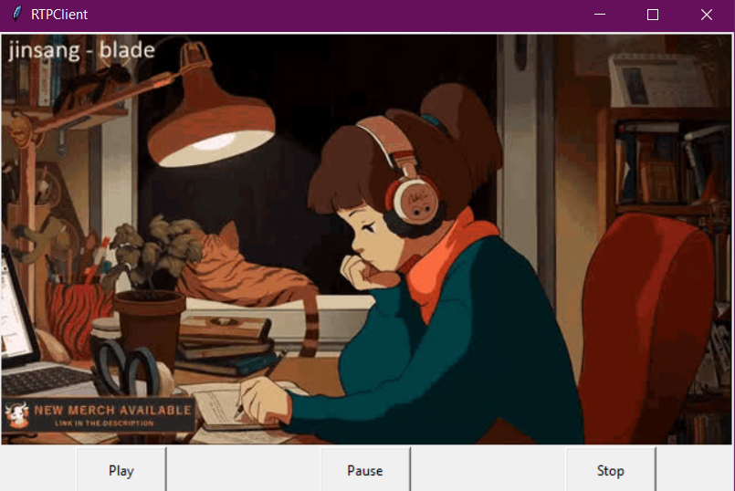
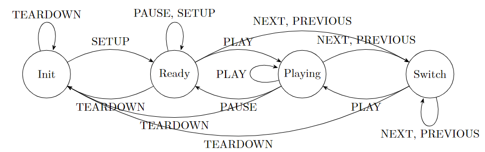
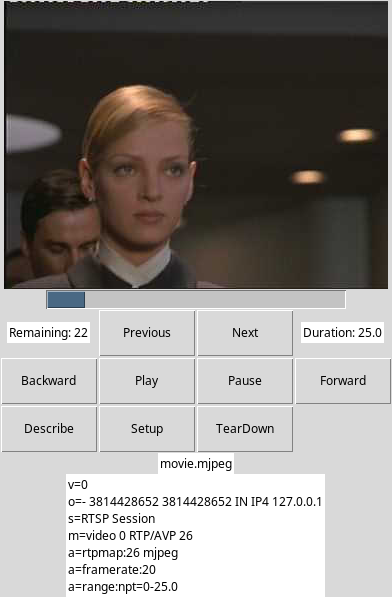
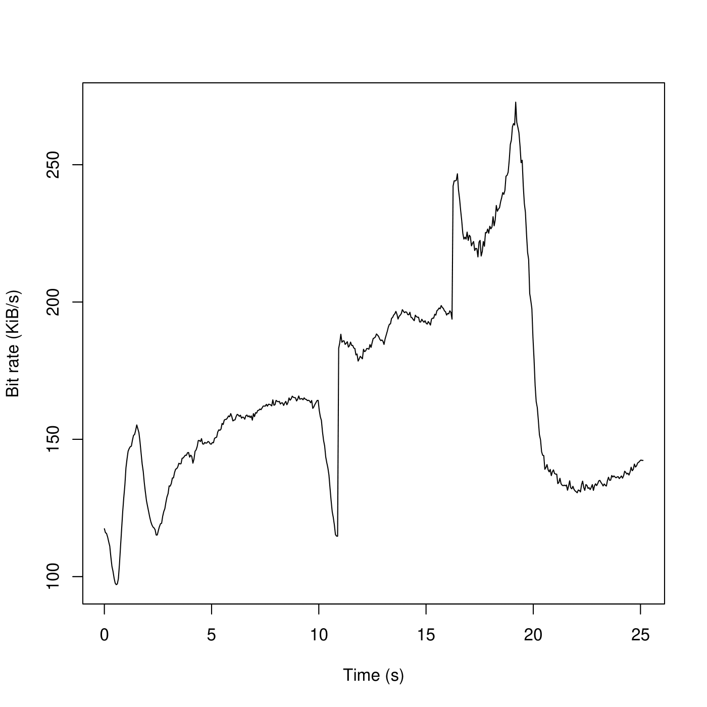
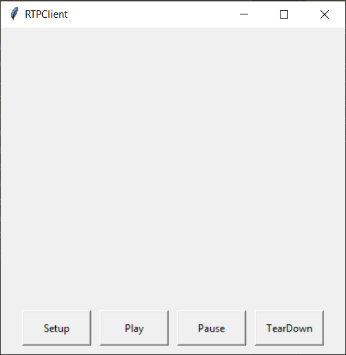
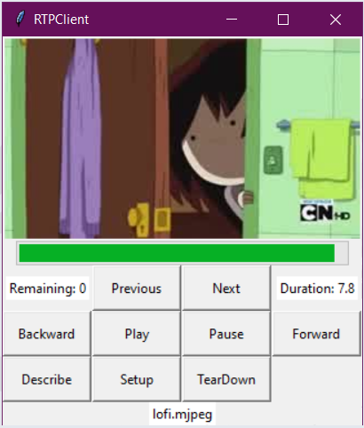

# Streaming MJPEG over RTSP (TCP) and RTP (UDP)

<p align="center">
    
</p>

**Description:**

A networking project with simple UI to allow streaming of MJPEG through RTSP (TCP) and RTP (UDP)

The full report of the project is available [Here](https://www.overleaf.com/read/xqhzkgwybsbp)

## General Information

- We design the server/client and protocol along with packages ourselves
- Following the RTP package format to send frame by frame information from server to client
- There are 3 different versions of the client, each with their respective state machine:
  1. Normal
  2. User friendly (simpler)
  3. More detailed (advanced)

## Testing

Final testing was done on two separate laptops (one for server and one for client) over a local are network (wifi)

## Technologies Used

- Python
- Socket Interface
- JPEG files compiled into MJPEG

## Details

1. Full State Machine

   
2. Detailed GUI version

    
3. Streaming Evaluation
    |Bit rate overtime| Framesize Histogram|
    |---|---|
    | | |
4. Comparison of 3 different GUIs
    |Normal| Simple| Detailed |
    |---|---|---|
    | | | |

## Setup

Requirements and Installations:

1. Python

## Usage

### Start Server

To start the server, run the following command:

```[bash]
python3 -m server <server_port>
```

For example, if you want the server to listen on port 2000, run:

```[bash]
python3 -m server 2000
```

### Start Client

To start the client, run the following command:

```[bash]
python3 -m client <server_addr> <server_port> <rtp_port> <video_file>
```

For example, if you want to stream file `movie.Mjpeg` using server at
`localhost` and port 2000, receive RTP frames from port 3000, run:

```[bash]
python3 -m client localhost 2000 3000 movie.Mjpeg
```
